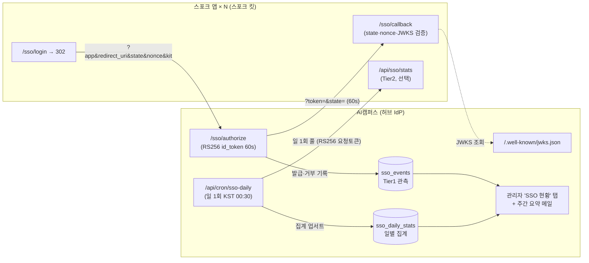

# SSO 허브 설계도 v2 — 연합 로그인 + 전 서비스 사용현황 중앙 관리

- 작성일: 2026-07-27 · 상태: **설계(제안) — 구현 전**
- 선행 문서: [`docs/prd/2026-06-20-sso-hub.md`](../prd/2026-06-20-sso-hub.md)(허브 PRD v1, 구현 완료·기능 OFF), [`docs/sso-spoke-integration-contract.md`](../sso-spoke-integration-contract.md)(스포크 계약 v1.1)
- 동반 문서: [`docs/sso/SSO-SPOKE-KIT.md`](SSO-SPOKE-KIT.md)(스포크 구현 패키지 설계)
- 작성 방법: 현황 판독(허브 SSO 코드·감사로그·배포설정) → 3갈래 설계(활성화/사용현황/스포크킷) → 3렌즈 검증(보안·무료티어·채택현실성)의 멀티에이전트 워크플로우 산출물을 통합. 검증에서 나온 blocker 2계열·major 다수를 본문에 반영 완료(§6).

---

## 0. 요약

**무엇을 만드나**: AI캠퍼스(이 앱)를 사내 Next.js 앱들(web-fashion, measure-web, OPR …)의 중앙 로그인 허브(IdP)로 승격하고, SSO로 연결된 전 서비스의 로그인·접속 현황을 허브 관리자 화면 한 곳에서 본다(일 1회 배치 갱신 + 주 1회 요약 메일).

**핵심 사실**: SSO 허브 자체는 **이미 구현돼 있다**(PRD v1, 2026-06-20 — 라우트 4종·lib 4종·DB 테이블 M010/M011·스포크 계약 문서까지). 남은 것은 ① Vercel env 4종 등록(유일한 하드 차단), ② 스테이징 E2E 검증, ③ 스포크 측 구현, 그리고 이번 설계의 신규 부분인 ④ **사용현황 중앙 관리(관측 계층)** 다.

**아키텍처 한 장**:



- 쿠키 공유 SSO는 불가(`*.vercel.app` = Public Suffix) → **60초 단명 RS256 id_token을 리다이렉트로 핸드오프**하는 기존 설계 유지.
- 관측은 2계층: **Tier 1** = 허브가 토큰 발급 시점에 스스로 기록(스포크 작업 0, 활성화 첫날부터 동작) / **Tier 2** = 스포크가 일별 집계값만 제공하고 허브 cron이 일 1회 풀(선택, PII는 서비스 경계를 넘지 않음).

---

## 1. 현황 — 이미 있는 것 / 남은 것

### 1.1 이미 구현됨 (코드 원문 대조 확인)

| 구성 요소 | 상태 |
|---|---|
| `app/sso/authorize·logout·userinfo`, `app/.well-known/jwks.json` | PRD F1~F8과 일치. 전 라우트 `runtime='nodejs'`, authorize에 IP 레이트리밋(60회/분) 실적용 |
| `lib/sso.ts`(RS256·60s)·`sso-keys.ts`(PKCS#8/SPKI·normalizePem)·`sso-clients.ts`(DB 우선→env 폴백·베이스 정확매칭·60s 캐시)·`sso-nonce.ts` | 일치 |
| DB `sso_clients`(M010)·`sso_nonces`(M011) | 멱등 마이그레이션 존재, `supabase/schema.sql` 동기화됨 |
| 로그인 `next` 새니타이즈, 스포크 계약 v1.1 | 존재 |

### 1.2 남은 갭 (검증에서 확정)

| # | 갭 | 성격 |
|---|---|---|
| G1 | **Vercel env 미설정**: `SSO_PRIVATE_KEY`/`SSO_PUBLIC_KEY`/`SSO_KID`(+`SSO_ISSUER` 명시 권장) — 미설정 시 SSO 라우트 전부 500 | 하드 차단 |
| G2 | **SSO 감사 로그 全無**: `app/sso/**`에 logAuth 호출 0건, `AuthLogType`에 sso 타입 없음 — PRD §6-10 미이행. 이번 설계의 Tier 1(§4)이 이를 해소 | PRD 문구와 실제 불일치 |
| G3 | 운영 Neon에 M010/M011 실행 여부 미확인, `sso_clients` 등록 0건(스포크 URL 미확정) | 확인 필요 |
| G4 | 허브측 `consumeNonce`는 호출처 없는 예비 코드 — replay 방어가 스포크 구현 품질에 전적으로 의존. §6-B2에서 userinfo 1회성 가드로 재활용 | 설계 보강 |
| G5 | `sso_nonces` 만료 행 정리 경로 없음(영구 누적) | cron 피기백으로 해소(§4.3) |
| G6 | 스테이징 E2E(AC2~AC8) 미실행, 스포크측 `/sso/callback` 미구현 | 롤아웃 소관(§7) |
| G7 | `.env.local.example`의 SSO 자리표시자·Vercel env 실상태 — 이 세션 권한 제약으로 실물 미확인 | 활성화 단계 0에서 확인 |

---

## 2. 설계 원칙 (v1에서 승계 + v2 추가)

1. **추가 비용 0**: Vercel Hobby·Neon Free·기존 의존성(jose)만. 신규 유료 서비스·신규 env 시크릿 최소화(사용현황 설계는 신규 시크릿 **0개**).
2. **하이브리드**: 각 스포크의 자체 로그인은 항상 유지. SSO는 "세션을 얻는 또 하나의 입구"이고, **가용성의 최종 보장선은 각 스포크 자체 로그인**이다(허브 다운 시 폴백).
3. **인가는 스포크 소관**: 허브 토큰은 "누구인지(email)"만 전달. 역할·권한은 각 스포크가 자기 DB에서 재조회.
4. **PII는 원 소유 서비스 밖으로 내보내지 않는다**(§4.4): 사용현황 수집은 집계값만 국경을 넘는다. 1,800명 실데이터 전제.
5. **1인 운영 지속가능성**: 시크릿·수동 절차·앱별 예외를 최소화. 절차는 런북·스크립트로 고정.

---

## 3. 활성화 런북 (OFF → ON)

> 상세 명령·SQL 전문은 본 절에 집약. 실행 시 각 단계 증거(출력)를 남기고, 완료 보고는 ①검증함/②확인필요로 분리한다.

| 단계 | 내용 | 핵심 |
|---|---|---|
| **0. 사전 스냅샷** | JWKS 현재 500(OFF) 확인 · Neon에 `SELECT to_regclass('public.sso_clients'), to_regclass('public.sso_nonces')` · Vercel env에 SSO_* 부재 확인 · `.env.local.example`/`.gitleaks.toml` 실물 확인(G7) · **Fluid compute 활성 여부 확인**(§4.3 cron maxDuration 근거) | 증거 확보 |
| **1. RSA 키 생성** | `openssl genpkey -algorithm RSA -pkeyopt rsa_keygen_bits:2048 -out sso_private_pkcs8.pem` → `openssl pkey -in … -pubout -out sso_public_spki.pem`. 헤더가 `BEGIN PRIVATE KEY`/`BEGIN PUBLIC KEY`인지 확인(PKCS#1이면 `openssl pkcs8 -topk8 -nocrypt`로 변환) | RSA-2048(60s 단명 토큰 전용이라 충분). 키 파일은 등록 후 즉시 삭제, repo 금지 |
| **2. SSO_KID** | `aicampus-rsa-YYYYMMDD` — 회전마다 반드시 갱신(스포크 JWKS 캐시 미스 유발 + 허브 publicJwksCache 키) | 고정 kid 금지 |
| **3. Vercel env 등록** | 4종을 **Production에만**: `vercel env add SSO_PRIVATE_KEY production < sso_private_pkcs8.pem` 방식(CLI 권장 — 멀티라인 PEM 복붙 실수 차단). `SSO_ISSUER=https://retail-ai-campus.vercel.app` 명시(trailing slash 없음, 스포크 issuer 검증값과 바이트 일치). `SSO_CLIENTS_JSON`은 설정하지 않음(DB 단일 소스). 등록 후 **재배포 필수** | Preview/Dev에는 미설정(=OFF가 안전 기본값) |
| **4. M010/M011 실행** | `POST /api/admin/migrate`(마스터 세션) → 응답에서 M010/M011 `ok|skip` 확인 → Neon으로 테이블 존재 재확인 | 건너뛰면 authorize 전부 400 + nonce 저장 조용한 실패 |
| **5. sso_clients 등록** | 표준 upsert문만 사용(아래). **2단계 등록 원칙**: 신규 앱은 `enabled=false`로 먼저 삽입 → 스포크 배포·출처 확인 후 별도 `UPDATE … SET enabled=true`(§6-B4). **[결정 2026-08-06]** ② 허브 활성화 단계에서는 `sso-selftest` 1건만 등록하고 실앱(web-fashion 등)은 URL 확정 후 ③ 파일럿에서 등록한다(§9-1) | 수기 UPDATE 금지, 삭제 대신 enabled=false |
| **6. 스모크** | S1 JWKS 200(개인키 성분 d/p/q 부재) · S2 미등록 app→400 · S3 state 누락→400. **+ known-good 6종 재실행**(로그인/가입OTP/재설정/영상/모바일/admin) 후에만 "활성화 완료" 선언 | CLAUDE.md known-good 규율 |
| **7. E2E (AC2~AC8)** | `sso-selftest` 임시 클라이언트(콜백=허브 자기 도메인 404 경로)로 스포크 없이 AC2~AC7 검증 + **`node scripts/sso-e2e-verify.mjs`**(T1~T11, 신규 의존성 0 — repo의 jose 재사용). 세션 필요 항목(T8~T11)은 `SSO_TEST_COOKIE` 환경변수로 허브 세션 쿠키를 넘길 때만 실행된다. **종료코드 0=전항 통과 / 1=실패 / 2=미검증(SKIP) 존재 → 0이 아니면 활성화 완료 선언 불가.** AC8은 파일럿(§7) | 검증 후 selftest `enabled=false` |

**② 활성화 단계에서 실제로 실행할 SQL — `sso-selftest` 1건만** (재실행 안전).
콜백은 허브 자기 도메인의 404 경로다(스포크 없이 302 Location만 읽으면 되므로 충분). AC2~AC7 검증이 끝나면 `enabled=false`로 되돌린다.

```sql
INSERT INTO sso_clients (app, name, redirect_uris, post_logout_redirect_uris, enabled)
VALUES ('sso-selftest', '허브 자체검증',
        ARRAY['https://retail-ai-campus.vercel.app/sso-selftest-callback'],
        ARRAY['https://retail-ai-campus.vercel.app/login'],
        true)  -- selftest는 검증 목적이라 즉시 true. 검증 후 반드시 false로 되돌릴 것
ON CONFLICT (app) DO UPDATE SET
  name = EXCLUDED.name, redirect_uris = EXCLUDED.redirect_uris,
  post_logout_redirect_uris = EXCLUDED.post_logout_redirect_uris,
  enabled = EXCLUDED.enabled, updated_at = now();

-- 검증 종료 후:
-- UPDATE sso_clients SET enabled = false, updated_at = now() WHERE app = 'sso-selftest';
```

**표준 등록 SQL — 실앱용 예시(③ 파일럿 단계에서 사용, ②에서는 실행하지 않는다)**:

```sql
INSERT INTO sso_clients (app, name, redirect_uris, post_logout_redirect_uris, enabled)
VALUES ('web-fashion', '이랜드 패션 웹',
        ARRAY['https://eland-apparel.vercel.app/sso/callback'],
        ARRAY['https://eland-apparel.vercel.app/login'],
        false)  -- ★ 항상 false로 삽입, 검증 후 별도 UPDATE로 활성화
ON CONFLICT (app) DO UPDATE SET
  name = EXCLUDED.name, redirect_uris = EXCLUDED.redirect_uris,
  post_logout_redirect_uris = EXCLUDED.post_logout_redirect_uris, updated_at = now();
```

운영 규칙: DB에 행이 1개라도 생기면 `SSO_CLIENTS_JSON` env 폴백은 **완전히 무시**된다(코드 확인) — env·DB 혼용 금지. 변경 반영은 인메모리 캐시로 최대 60초 지연. 등록·변경 SQL과 사유는 `docs/HISTORY.md`에 기록.

---

## 4. 사용자 로그·접속현황 중앙 관리 (이번 설계의 신규 핵심)

### 4.1 2계층 수집 모델

| | Tier 1 — 허브 자체 관측 | Tier 2 — 스포크 일별 리포트 |
|---|---|---|
| 원천 | 허브 `/sso/authorize`·`/sso/logout`이 발급·거부 시점에 직접 기록. 코드가 이미 손에 쥔 값: email·uid·app(aud)·IP·UA·시각 | 스포크가 자기 쪽에서 하루 단위 집계(자체 로그인 수·DAU 등) |
| 스포크 작업 | **0** | 킷의 stats 엔드포인트 + 어댑터 메서드(선택) |
| 커버리지 | "누가·언제·어느 앱에 **SSO 로그인**했나" + 거부/공격 시도. 단, **스포크 세션이 살아있는 동안의 재방문은 안 보임**(발급 기준 — DAU가 아님) | 스포크 자체 로그인(하이브리드 사각), 앱 내 활동(DAU·PV) |
| 도입 시점 | **v1 — SSO 활성화와 동시 선탑재 권장**(env 없이도 휴면 배포 가능) | v1.5 — 파일럿 스포크 1개부터 |

> **라벨링 주의(검증 반영)**: Tier 1 수치는 "SSO 발급(재인증) 기준"이지 앱 이용량(DAU)이 아니다. 관리자 화면·메일에 이 구분을 명시하고, "어제 measure-web 몇 명 썼나"에 답하려면 Tier 2 `activeUsers`(스포크 정의 DAU)가 필요하다 — **파일럿에서 Tier 2를 필수 항목으로 승격**한다.

**저장소 결정**: 기존 `auth_logs` 재사용이 아니라 **신규 `sso_events` 테이블**. 근거: auth_logs에는 `app` 컬럼이 없어 앱별 집계·인덱스가 불가하고, SSO 이벤트는 통계성 대량 행(추정 ~3,300행/일)이라 보안 감사 스트림과 보존 정책(90일 순환 vs 장기)이 다르다. PRD §6-10의 "auth_logs 기록" 문구는 **"sso_events 기록 + AdminLogs `source='sso'` 노출"로 개정**한다(이중 기록 금지 — 단일 진실원천).

**이벤트 타입**: `issue`(발급) · `deny_unknown_app` · `deny_redirect_mismatch` · `deny_state_missing` · `login_required` · `rate_limited` · `logout`. 기록 헬퍼 `logSsoEvent()`는 `lib/audit.ts`에 추가(getClientIp 재사용, 실패는 삼킴 — 가용성 우선). `login_redirect`(미로그인→/login 302)는 **원시 행으로 기록하지 않는다**(자동 리다이렉트 도입 시 페이지뷰급 폭증 — 검증 반영). **§7 5단계(자동 리다이렉트) 전 전환 필요** — 표본/카운터 전환 없이는 자동 리다이렉트 도입 후 이 분기의 물량이 정상인지 판정할 수치가 없다(§7 각주 1 참조).

**PII 가드(코드 레벨 강제, 검증 반영)**: `logSsoEvent`의 `detail`에 이메일 패턴 자동 마스킹 sanitizer 적용 + `app` 값 64자 truncate·제어문자 제거(로그 인젝션 방어). 토큰 원문·전체 쿼리스트링 기록 금지.

**킷 버전 텔레메트리(검증 반영)**: 스포크 킷의 `/sso/login`이 authorize 쿼리에 `kit=<버전>`을 항상 덧붙이고, 허브 authorize가 이를 `sso_events.detail`에 기록 — **stats 미참여 스포크 포함 전체**의 킷 버전 드리프트가 로그인 트래픽만으로 자동 관측된다(스포크 추가 작업 0, v1부터 동작).

### 4.2 Tier 2 수집: 허브 풀(pull) + RS256 요청 토큰 — **단일 스펙(계약 v2 §9)**

> 검증에서 설계 초안 간 인증 방식 모순(blocker)이 발견되어 아래로 **확정 통일**한다. 스포크 킷 문서도 동일 스펙만 참조한다.

- **방식**: 허브 cron이 일 1회 각 스포크의 `GET /api/sso/stats?days=7`을 병렬 호출(Promise.allSettled + 타임아웃 5s). `days=7` 범위 요청이라 스포크가 며칠 다운됐다 복구돼도 **자동 백필**된다.
- **인증**: 허브가 호출 직전 기존 `SSO_PRIVATE_KEY`로 서명한 **60초 RS256 요청 토큰**을 `Authorization: Bearer`로 제시 — 클레임 `{iss=SSO_ISSUER, aud=<app>, sub='sso-hub', scope='stats:read', iat, exp=iat+60}`. 스포크는 SSO 콜백에 이미 있는 `createRemoteJWKSet` 검증 경로를 재사용하되 **`scope==='stats:read' && sub==='sso-hub'`를 반드시 추가 검증**(같은 키·같은 aud로 서명되는 SSO id_token 탈취분의 오용 차단).
- **신규 시크릿 0**: per-client secret 방식은 기각 — 시크릿 발급·배포·로테이션이 스포크 수만큼 생기는 1인 운영 부채. (푸시 ingest는 v2에서 원하는 스포크에 한해 병행 허용 가능한 구조로만 남긴다.)
- **응답 스키마**(camelCase, 계약 v2 §9에 필드명까지 명문화 — 이 표만이 유일한 스펙):

```jsonc
{
  "app": "measure-web",
  "kitVersion": "2.0.0", "contractVersion": "2",
  "statsImplemented": true, "days": 7,
  "stats": [ // date = KST(Asia/Seoul) 기준 하루 — 허브 집계와 동일 기준
    { "date": "2026-07-26", "ssoLogins": 12, "selfLogins": 34,
      "uniqueUsers": 40, "activeUsers": 55, "pageviews": 810 }
  ]
}
```

`selfLogins`(자체 로그인 수)와 `activeUsers`(스포크 정의 DAU)가 **Tier 2의 존재 이유**다(허브가 못 보는 값) — 어댑터 예시에 자체 로그인 경로 계측을 포함한다(킷 문서 §2.4). 허브는 `source='hub'`(Tier1)와 `source='spoke'`(Tier2) 행을 분리 저장해 같은 사건의 이중 계상을 대시보드에서 구분한다.

### 4.3 배치: 통합 cron `/api/cron/sso-daily`

**플랫폼 제약(2026-07 웹 실측 검증)**: Vercel cron은 2026-01부로 **전 플랜 프로젝트당 100개**로 확대(슬롯 희소성 소멸). 단 **Hobby는 여전히 일 1회 최소 빈도**(시간 단위 스케줄은 배포 실패), 실행 시각은 지정 시각 기준 **1시간 윈도 내 임의 시점**, **실패 시 재시도 없음**. 함수 시간 Hobby 기본 60s(Fluid compute 시 300s). 근거: vercel.com/changelog/cron-jobs-now-support-100-per-project-on-every-plan · vercel.com/docs/cron-jobs.

```
/api/cron/sso-daily   (CRON_SECRET 검증 — 기존 cleanup-test-account 패턴 재사용)
schedule: "30 15 * * *"  (UTC 15:30 = KST 00:30, 직전 KST 하루 마감 집계)
export const maxDuration = 60

① Tier1 집계 업서트 — sso_events → sso_daily_stats(source='hub'), 최근 7 KST일 재집계
   (cron 지연·연속 누락 흡수 — 멱등 업서트라 안전, 주당 ~2만 행 규모라 비용 무시 가능)
② sso_events 90일 초과 DELETE (보존 정책)
③ sso_nonces 만료 행 DELETE (G5 해소)
④ Tier2 풀 — sso_clients.stats_url 이 NOT NULL인 앱 병렬 fetch(days=7) → 업서트.
   업서트 전 값 범위 검증(음수·1e6 초과 거부), 이상치·실패는 admin_audit_logs 기록
⑤ 주간 요약 메일 — 요일 분기가 아니라 "마지막 발송 7일 이상 경과" 마커로 트리거
   (cron 누락 시 메일이 조용히 스킵되는 문제 방지 — 검증 반영)
```

각 단계는 try/catch로 격리(한 단계 실패가 다음을 막지 않음). 슬롯이 더 이상 희소하지 않으므로 타임아웃이 실측되면 ②③을 별도 cron으로 분리하는 선택지도 열려 있다(현재는 운영 단순성 우선으로 1개). **cron 무실행 감지**: 마지막 성공 실행 시각을 AdminSso에 표시하고 48시간 초과 시 경고 배지(재시도 없는 best-effort 특성 보완).

사용자 요구 충족: "일 1회" = 이 cron 자체, "주 1회" = ⑤ 요약 메일. Hobby 일 1회 제약과 정확히 정합.

### 4.4 PII 최소화 (1,800명 실데이터, §6-7)

**원칙: email은 그 데이터의 원 소유 서비스 DB 밖으로 내보내지 않는다.**

- Tier 2는 **일별 집계값만** 국경 통과. email 단위 원시 로그 전송 금지(스키마 합의·탈퇴자 삭제 전파 같은 관리 부채 원천 차단). email 해시 가명화도 기각 — 1,800명 후보 공간은 사전 대입으로 즉시 역산된다.
- 사용자 단위 조회("이 사람이 언제 어느 앱에 로그인했나")는 **허브 자기 데이터인 Tier 1 `sso_events`로 충족**(auth_logs가 email을 저장하는 것과 동일한 지위).
- 관리자 overview API 응답은 **email 필드가 아예 존재하지 않는 타입으로 정의**(타입 레벨 강제 — 검증 반영). email 드릴다운은 기존 AdminLogs(`perm:'logs'`) 경로로만. 응답 `Cache-Control: no-store`.
- 주간 메일(외부 전송 경로)에도 집계값만.

### 4.5 DB 스키마 — 마이그레이션 **M013** (멱등)

```sql
-- M013: SSO 관측 이벤트 + 일별 통계
CREATE TABLE IF NOT EXISTS sso_events (
  id          BIGSERIAL PRIMARY KEY,
  app         TEXT NOT NULL,          -- aud. 미등록 요청은 새니타이즈된 원문(64자 truncate)
  event       TEXT NOT NULL,          -- issue | deny_* | login_required | rate_limited | logout
  email       TEXT,                   -- issue/logout 시 lowercase. 거부·미로그인은 NULL
  ip          TEXT,
  user_agent  TEXT,
  detail      TEXT,                   -- 최소한만(kit=버전 등). 토큰 원문·전체 쿼리 금지
  created_at  TIMESTAMPTZ NOT NULL DEFAULT now()
);
CREATE INDEX IF NOT EXISTS sso_events_app_idx     ON sso_events (app, created_at DESC);
CREATE INDEX IF NOT EXISTS sso_events_created_idx ON sso_events (created_at);
CREATE INDEX IF NOT EXISTS sso_events_email_idx   ON sso_events (email, created_at DESC);

CREATE TABLE IF NOT EXISTS sso_daily_stats (
  app          TEXT NOT NULL,
  stat_date    DATE NOT NULL,               -- KST(Asia/Seoul) 기준 하루
  source       TEXT NOT NULL DEFAULT 'hub', -- 'hub'=Tier1 | 'spoke'=Tier2 (이중 계상 구분)
  sso_logins   INT NOT NULL DEFAULT 0 CHECK (sso_logins   BETWEEN 0 AND 1000000),
  unique_users INT NOT NULL DEFAULT 0 CHECK (unique_users BETWEEN 0 AND 1000000),
  denied       INT NOT NULL DEFAULT 0 CHECK (denied       BETWEEN 0 AND 1000000),
  self_logins  INT CHECK (self_logins  BETWEEN 0 AND 1000000),  -- Tier2 전용
  active_users INT CHECK (active_users BETWEEN 0 AND 1000000),  -- Tier2 전용(DAU)
  pageviews    INT CHECK (pageviews    BETWEEN 0 AND 100000000),-- Tier2 전용(선택)
  extra        JSONB,
  reported_at  TIMESTAMPTZ NOT NULL DEFAULT now(),
  PRIMARY KEY (app, stat_date, source)      -- 재전송·재집계 멱등 업서트 키
);

ALTER TABLE sso_clients ADD COLUMN IF NOT EXISTS stats_url TEXT; -- NULL = Tier2 미참여
```

**보존·용량(5앱·1,800명 기준 재계산 — 검증 반영)**: `sso_events` ~450B/행 × ~3,300행/일 → 90일 ≈ 30만 행 ≈ **135MB**(Neon Free 0.5GB 내 안전). 1년 무기한 보존 시 ~550MB로 한도 초과 → **원시 90일 + 집계 영구**(연 수천 행, <1MB) 확정. v1(cron 도입 전)의 보존 정리는 overview 로드 시 lazy DELETE + **90일 내 v1.5 cron 도입을 시한으로 명시**(관리자가 탭을 안 열면 무한 증가하는 약점 보완). 운영 셀프체크: `pg_total_relation_size('sso_events')` 주간 1회.

### 4.6 관리자 화면 — 'SSO 현황' 탭

기존 패턴 그대로 4파일 + API 1개: `lib/types.ts` AdminTabType에 `'sso'` → `AdminDashboard.tsx` TABS에 `{key:'sso', label:'SSO 현황', masterOnly:true}`(v1은 masterOnly — `perm:'sso'` 신설은 권한편집 UI 정합 확인 후 v2) → renderContent case → `components/AdminSso.tsx` 신규(recharts·adminFetch 재사용) → `app/api/admin/sso/overview/route.ts`(requireMaster·no-store).

표시 항목:
- 앱별 카드: 오늘·7일·30일 **SSO 발급(재인증) 수 / 유니크 사용자 / 거부 수** — 라벨에 "발급 기준, 스포크 세션 유지 중 방문은 미집계" 툴팁(§4.1 라벨링 주의).
- Tier2 참여 앱: **selfLogins·activeUsers(DAU)** 병기 + 마지막 동기 시각 + 3일 누락 경고 배지.
- 14일 추이 BarChart(AdminStats recharts 패턴 이식), 최근 실패 이벤트 20건(event·app·ip·시각 — **email 미포함**).
- cron 상태: 마지막 성공 실행 시각 + 48h 초과 경고(§4.3).
- 통계 한계 고지 1줄: "로깅은 가용성 우선(실패 무시) — 수치는 최소치".

**캐빗 — 프로빙 재분류 착시(설계 렌즈 지적)**: 등록 앱 실패 목록과 미등록 프로빙 목록의 분리는 `EXISTS (SELECT 1 FROM sso_clients c WHERE c.app = sso_events.app)`(`app/api/admin/sso/overview/route.ts:123`·`:131`)로 **조회 시점의 `sso_clients` 현재 상태**를 기준으로 매번 재계산된다 — 이벤트 기록 시점의 스냅샷이 아니다. 따라서 `sso_clients`에서 행을 DELETE하거나 `app` 식별자를 rename하면, 그 앱의 **과거 정당한 실패 이벤트가 즉시 "미등록 프로빙(공격 추정)"으로 소급 재분류**된다(카드에서도 사라진다). 반대로 `enabled=false`는 위 EXISTS 조건에 `enabled`가 들어가지 않으므로 여전히 "등록"으로 집계돼 재분류가 일어나지 않는다. 즉 **§5.2의 "삭제 대신 `enabled=false`" 운영 규칙이 이 착시를 막는 유일한 가드이며, 코드 레벨 강제는 없다**(오너 1인의 절차 준수에 의존).

> 후속 백로그: 근본 해소책은 `sso_events`에 기록 시점 `was_registered` 스냅샷 컬럼을 추가(M014)하는 것이나, M013조차 아직 운영 미적용이라 지금 스키마를 늘리지 않는다 — 이번 범위 밖.

주간 요약 메일: `lib/email.ts`에 범용 `sendMail()` 추가(기존 transport 패턴 재사용) → 수신 `MASTER_ADMIN_EMAILS` → 내용은 앱별 주간 집계·전주 대비·denied 합계·Tier2 동기 상태·**킷 버전 드리프트 경고**(보안 PATCH 기한 경과 강조). 발송 조건: SSO 활성 && 지난주 이벤트 1건 이상.

---

## 5. 운영 설계

### 5.1 키 회전

- **주기: 정기 12개월 + 유출 의심 시 즉시.** 60초 단명 토큰 전용 키라 노출 창이 극히 짧다 — 더 짧은 주기는 1인 운영에서 이득 대비 장애 리스크만 키움.
- **v1 절차(단일 키 스왑)**: 새 키+새 KID 생성 → env 3종 교체 → 재배포 → 스모크 S1+AC4. 전환 순간 직전 60초 내 발급 토큰은 검증 실패할 수 있으나 사용자는 SSO 재진입으로 즉시 자가 회복(수용). 트래픽 최저 시간대 시행.
- **"즉시" 회전의 실제 SLA(검증 반영)**: 스포크 JWKS 캐시(10분)+`createRemoteJWKSet`의 kid 캐시 특성상, 유출 키로 서명된 위조 토큰이 **최대 10분간** 유효 검증될 수 있다. 인시던트 런북에 "즉시 = 신규 토큰 무효화, **완전 전파 = +10분**"을 명시하고, 그 10분간 해당 앱 로그인을 자체 로그인으로 안내하는 옵션을 체크리스트에 포함.
- **v1.1 개선(무블립)**: `SSO_PUBLIC_KEY_PREV`/`SSO_KID_PREV` env로 JWKS에 신·구 2키 동시 노출 → 24시간 뒤 PREV 제거. 회전 리허설(롤아웃 4단계) 실측 후 착수 판단.
- **운영 자동화(검증 반영)**: 회전 절차를 `scripts/sso-rotate.sh`(openssl 생성 → vercel env add 3종 → redeploy → JWKS 스모크)로 스크립트화, 연 1회 회전을 캘린더 등재.

### 5.2 sso_clients 등록 — 2단계 + 출처 확인 (검증 반영: 사회공학 방어)

redirect_uri 정확매칭은 토큰 오발급을 막는 **유일한 1차 방어선**인데, 그 방어선을 채우는 등록 절차에 검증이 없으면 "IT팀 사칭으로 이 URL 등록해 주세요" 한 번에 뚫린다. 따라서:

1. 신규 앱은 항상 `enabled=false`로 삽입(§3 표준 SQL).
2. 오너가 직접 `curl https://<도메인>/sso/callback`으로 실제 스포크 킷 배포를 확인(예상된 403 응답 형태).
3. 요청 출처를 **기록이 남는 채널**(사내 메일/티켓)로 재확인한 뒤에만 `enabled=true` UPDATE. 변경 SQL·사유는 HISTORY.md 기록.

v1은 관리자 UI 없이 Neon SQL 직접(변경 빈도 연 수회·등록 주체 1인 — UI는 공격 표면만 추가). 등록 앱 5개 초과 또는 권한 위임 시 AdminSso 탭 확장 재검토.

### 5.3 장애 모드

| 장애 | 스포크 영향 | 완화 |
|---|---|---|
| 허브(Vercel) 다운 | SSO 로그인 불가. **기존 스포크 세션은 무영향**(host-only 쿠키·자기 시크릿). 신규 로그인은 자체 로그인 폴백 | 계약에 명문화: 자동 리다이렉트를 쓰더라도 "자체 로그인으로 진행" 우회 링크 **필수(강등 불가)** |
| Neon 다운 | SSO 발급 중단(레지스트리 조회 불가). 스포크 자체 로그인은 각자 DB라 무영향 | JWKS 라우트는 env만 사용 — **기발급 토큰의 스포크 검증은 Neon 다운 중에도 정상** |
| Upstash 미설정/다운 | 레이트리밋이 인스턴스별 인메모리 폴백(약화) | 수용. Upstash free는 월 50만 커맨드(2025-03 개정)로 여유 — 활성화 단계 0에서 월 사용량 1회 확인 |
| **Vercel Hobby ToS·무SLA (수용 리스크 — 검증 반영)** | Hobby는 비상업 용도 한정. **1,800명 임직원용 사내 앱은 정의상 상업적 사용에 해당할 소지**가 있고 SLA도 없다. 허브 승격 시 통지/중단의 피해 반경이 "앱 1개"→"전사 SSO"로 확대 | (a) 자체 로그인 폴백이 "허브 계정 중단" 시나리오까지 커버함을 명시, (b) 통지 수신 시 **Pro 전환($20/월) 또는 허브 이전을 비상 경로로 문서화**, (c) 이 리스크를 인지하고 수용함을 본 설계에 기록, (d) **[결정 2026-08-06] Hobby 유지·리스크 수용 확정**(§9-6) — Pro 전환은 비상 경로로만 유지 |

**세션 체감**: SSO의 "한 번 로그인" 체감 = 허브 `user_session` 수명(기본 6h — rememberMe 미체크 시 브라우저 세션 쿠키라 **브라우저 종료마다 재로그인** / rememberMe 30일). 정책은 무변경하되, **SSO 경유 로그인 화면에 "로그인 유지를 켜면 다른 사내 앱도 자동 로그인됩니다" 안내 1줄을 파일럿과 동시 시행**(검증 반영 — 파일럿 성공 판정이 "한 번 로그인 체감"인데 그 레버를 뒤로 미루지 않는다). 기본 체크 여부만 v1.1 결정으로 남김.

**모바일 한계(검증 반영)**: Capacitor 앱 WebView의 쿠키 저장소는 모바일 Chrome과 분리 — 허브를 주로 **앱**으로 쓰는 직원은 모바일 브라우저에 허브 세션이 없어 폰에서 스포크 링크를 열면 재로그인이 구조적으로 발생한다. v1 비목표(N4) 유지하되 파일럿 관찰 항목에 모바일 유입 비율·재로그인 빈도를 넣고, 안내 문구("모바일은 Chrome에서 AI캠퍼스 로그인 1회 필요")를 계약 부록으로 제공. 앱 내 스포크 브리지는 명시적 비목표.

---

## 6. 보안 보강 — 3렌즈 검증 반영 결정표

> 멀티에이전트 검증(보안 렌즈는 sso-auth-architect가 코드 원문 대조로 수행)에서 나온 지적과 반영 결정. **B로 시작하는 항목은 구현 착수 전 필수 반영.**

| # | 심각도 | 지적 | 반영 결정 |
|---|---|---|---|
| B1 | blocker | **URL 쿼리의 60초 id_token**(PII 포함 JWT)이 Vercel 함수 로그·Sentry request.url·브라우저 히스토리에 잔존. 증폭 경로: 현행 `/sso/userinfo`는 **nonce 1회성 체크가 없어** 로그에서 60초 내 토큰을 얻은 제3자가 반복 호출로 이름·소속·직급까지 조회 가능 | ① 허브 Sentry `beforeSend`/`beforeBreadcrumb`에 `token` 쿼리 마스킹 추가 + 스포크 킷 체크리스트에 동일 항목. ② **userinfo에 nonce 1회 소비 가드 추가**(호출처 없던 `consumeNonce`를 여기 재활용 — G4 해소) + userinfo 레이트리밋. ③ 중기 승격 경로(form_post 또는 code 교환)는 PRD 미해결 5 유지 |
| B2 | blocker | 설계 초안 간 Tier2 stats 인증 모순(RS256 vs 정적 시크릿) — 그대로 구현 시 상호 운용 불가 | **RS256 요청 토큰으로 통일 확정**(§4.2). 계약 v2 §9가 유일한 스펙. `SSO_STATS_SECRET` 방식 폐기 |
| B3 | major | `sanitizeNext`(운영 중)·킷 `sanitizeReturnTo`의 prefix 문자열 검사는 **탭/CR/LF 삽입으로 우회 가능**(WHATWG URL 파서가 제어문자를 위치 무관 제거 — `/\t/evil.com` → `//evil.com`) | **URL 파서 기반 검증으로 교체**(더미 origin에 파싱해 origin 유지 판정). 허브 `app/login/page.tsx`와 킷 **양쪽 동시 패치** + `/\t/evil.com` 류 회귀 테스트 추가. **스포크 킷 롤아웃은 이 패치 이후** |
| B4 | major | sso_clients 등록에 도메인 소유·출처 검증 절차 부재(사회공학으로 공격자 도메인이 정당한 클라이언트가 될 수 있음) | §5.2의 2단계 등록(enabled=false → 실배포 확인 → 기록 채널 출처 확인 → enabled=true) 표준화 |
| B5 | major | "즉시" 키 회전의 실제 전파는 최대 10분(JWKS 캐시) — 인시던트 대응 시 잘못된 확신 | §5.1에 SLA 명시 + 10분간 자체 로그인 안내 옵션 |
| M1 | minor | Tier2 보고값 무결성(음수·이상치로 대시보드 오염) | M013 CHECK 제약 + cron ④ 업서트 전 범위 검증(§4.5) |
| M2 | minor | overview API의 email 미포함이 서술적 요구에 그침 | email 필드가 없는 응답 타입 정의(타입 강제) + logSsoEvent detail 자동 마스킹(§4.4) |

---

## 7. 롤아웃 로드맵

| 단계 | 내용 | 완료 판정 |
|---|---|---|
| **0. 보안 선행 패치** | B3(sanitizeNext URL 파서 검증+회귀 테스트) · B1①(Sentry 토큰 마스킹) · B1②(userinfo nonce 가드+레이트리밋) — 모두 허브 코드, SSO OFF 상태에서 배포 가능 | tsc·build·golden 테스트 + security-reviewer 게이트 |
| **1. 관측 선탑재** | M013 + `logSsoEvent` + authorize/logout 계측 + AdminSso 탭 + overview API (env 없이 휴면 — 활성화 첫날부터 기록 확보) | tsc·build + §6-M2 타입 강제 확인 + 운영 migrate 1회 |
| **2. 허브 활성화** | 런북 §3 단계 0~7 (키·env·재배포·클라이언트 등록·스모크·selftest E2E) | 스모크 S1~S3 + AC2~AC7 증거 + **known-good 6종 재실행** |
| **3. 파일럿 = web-fashion** | **URL 최종 확인(사용자) — 2026-07-27 현재 미완료(§9-1: 운영 URL 미확정)**, 이 확인 전에는 착수 불가 → 확인 후 `sso_clients` 등록 → enabled=true → 스포크에 킷 설치(계약 v2) → AC8 + Tier2 stats 필수 포함 | AC8 + 계약 체크리스트 전항 + nonce 재사용 거부 실측 + **1주 관찰**(Sentry 0·하이브리드 정상·모바일 유입 관찰) |
| **4. 확대** | measure-web → OPR (URL 확정 순). 앱 하나 완료 후 다음 착수(동시 확대 금지) | 앱별 동형 검증 + v1.5 cron(`sso-daily`) 가동 |
| **5. 정착(선택)** | 미들웨어 자동 리다이렉트(+자체 로그인 우회 링크 필수, 로그아웃 루프 방지 — 킷 문서 §2.7), 주간 메일, 키 회전 리허설, rememberMe 기본 체크 검토 | **선행 조건(각주 1)**: `login_required` 표본/카운터 전환 완료 → 자동 리다이렉트 앱에서 로그아웃 동작 확인 + 회전 블립 실측 기록 |

> **[^1] §7 5단계 선행 조건 — `login_required` 관측 전환**: 미로그인 302 분기(`login_required`)는 현재 `sso_events`에 원시 행으로 기록되지 않는다(§4.1) — 자동 리다이렉트가 켜지면 미로그인 유입이 authorize로 몰리는데, 그 물량이 정상 범위인지 판정할 수치가 없다. **권고: 카운터 업서트** — `sso_daily_stats`에 `source='hub'` 행으로 일별 합계(기존 M013 PK `(app, stat_date, source)` 재사용, v1.5 cron의 Tier1 집계 업서트에 컬럼 1개를 얹는 수준). 근거: 저장량 증가가 사실상 0(앱수×일수로 상한 — §4.5의 집계 행 범주 그대로)이고 신규 테이블·라우트가 불필요해 구현 비용이 가장 낮다. 대안인 1/N 랜덤 표본 원시행은 포렌식 가치(ip·UA 보존)가 있으나, 전량 기록 시 자동 리다이렉트 도입 후 트래픽 가정(1만 히트/일)에서 90일 약 405MB가 추가된다 — **405MB 단독으로는 0.5GB를 넘지 않지만, §4.5의 기존 `sso_events` 90일 베이스라인 135MB와 합산하면 약 540MB로 Neon Free 0.5GB(512MB) 한도를 초과**한다. 따라서 표본율 설계가 추가로 필요하고, `FAILURE_EVENTS`에 걸려 관리자 화면의 최근 실패 20건 목록(§4.6)을 잠식하므로 overview 쿼리 수정이 동반된다. **이 전환이 완료되기 전에는 5단계를 완료로 판정하지 않는다.**

---

## 8. 우려점 · 현실적 한계 · 장단점 (요약)

### 장점
1. **구현 리스크가 낮다** — 허브 코어는 이미 구현·게이트 통과 상태. 이번 신규분(관측 계층)도 기존 패턴(migrate·audit·AdminStats·cron) 재사용.
2. **추가 비용 0·신규 시크릿 0** — RS256 키 재사용으로 stats 인증까지 해결. 무료티어 한도(cron·스토리지·Upstash) 실측 검증 결과 전부 여유.
3. **점진·가역** — 하이브리드라 스포크 자체 로그인이 항상 살아있고, 앱 하나씩 붙이며 언제든 enabled=false로 개별 차단 가능.
4. **PII 설계가 보수적** — 집계값만 이동, email은 원 소유 DB 밖으로 안 나감.

### 우려점 (수용/완화 결정 포함)
1. **URL 토큰 노출면**(§6-B1) — 60s TTL+nonce로 완화하되 로그·Sentry 마스킹과 userinfo 가드가 **필수 전제**. 보안 요구가 오르면 code 교환으로 승격.
2. **Vercel Hobby ToS·무SLA**(§5.3) — 1,800명 사내앱의 IdP를 Hobby에 두는 것은 약관상 회색지대 + 중단 시 전사 SSO 영향. 자체 로그인 폴백 + Pro 전환 비상 경로로 수용. **[결정 2026-08-06]** Hobby를 유지하고 이 리스크를 수용한다 — 각 스포크의 자체 로그인 폴백이 항상 살아 있어 허브 중단이 전면 장애가 되지 않기 때문이며, Pro 전환($20/월)·허브 이전은 ToS 통지나 중단 발생 시 발동하는 **비상 경로**로만 유지한다(§9-6).
3. **허브 = SPOF 집중** — 로그인(폴백 있음)뿐 아니라 이제 관측·통계도 허브에 집중된다. 통계는 유실돼도 서비스 영향 없음(수용).
4. **cron 무재시도** — 7일 재집계 윈도·days=7 백필·발송 마커로 결손을 자가 치유하되, 48h 무실행 경고로 관측.

### 현실적 한계
1. **표준 OIDC가 아니다** — authorization code+PKCE·refresh token·discovery 없음. 사내 Next.js 앱 간 연합엔 충분하나, 외부 SaaS 연동·비 Next.js 스택은 별도 작업.
2. **글로벌 로그아웃 없음** — 허브 로그아웃해도 각 스포크 세션은 자기 TTL까지 유지(역방향: 스포크 로그아웃 시 자동 리다이렉트 루프 방지 장치를 킷에 포함).
3. **"한 번 로그인" 체감은 조건부** — rememberMe 미사용자는 브라우저 종료마다, 모바일(Capacitor 앱)은 쿠키 저장소 분리로 체감 실패. 안내 문구로 완화, 근본 해결은 비목표.
4. **Tier1 수치는 DAU가 아니다** — 발급(재인증) 기준. 이용량은 Tier2가 있어야 답한다(파일럿 필수 승격으로 완화).
5. **1인 운영 의존** — 키 회전·등록·킷 전파가 전부 오너 1인의 수동 절차. 스크립트화·캘린더 등재·텔레메트리로 부담을 낮추되 구조적 한계는 남는다.

---

## 9. 미해결 질문 (사용자 결정 필요)

1. **web-fashion 운영 URL**이 `https://eland-apparel.vercel.app`이 맞는지 최종 확인 — 확인 전 활성 등록 금지. → **[결정 2026-08-06] 미확정.** ② 허브 활성화는 `sso-selftest` 임시 클라이언트만으로 진행한다(런북 §3 단계 5 = selftest 1건만 등록). 실앱 `sso_clients` 등록은 URL 확정 후 ③ 파일럿 단계에서 수행.
2. measure-web·OPR **운영 도메인 확정 시점** (+ OPR의 실제 스택 — Pages Router/비Next.js면 킷 수동 이식). → **미정(② 허브 활성화에 비차단)**
3. PRD §6-10 문구 개정 승인: "auth_logs 기록" → "sso_events 기록 + AdminLogs source='sso'". → **[결정 2026-08-06] 승인.** 단 개정 문구에 `sso_events`의 등급을 **"가용성 우선 관측 로그 — `after()` + 실패 삼킴 구조라 완전성 미보장"**으로 명시하고, **감사 증적으로 격상하지 않는다**. (구조 근거: `app/sso/authorize/route.ts:113`이 응답 이후 `after()`로 기록, `lib/audit.ts:108-110`이 기록 실패를 삼킴.) 완전성이 보장되는 감사 등급이 필요해지면 **별도 과제**로 분리한다.
4. 주간 요약 메일 수신 범위: `MASTER_ADMIN_EMAILS`만 vs admin 포함. → **미정(② 허브 활성화에 비차단)**
5. `@eland.co.kr` 예외 허용 계정의 스포크 allowlist 정책(PRD 미해결 4 승계). → **미정(② 허브 활성화에 비차단)**
6. Vercel Hobby ToS 리스크(§5.3)의 수용 vs Pro 선제 전환. → **[결정 2026-08-06] Hobby 유지 · 리스크 수용.** 근거 = 각 스포크에 자체 로그인 폴백이 항상 살아 있어(§2 원칙 2·§5.3) 허브 중단이 전면 장애가 되지 않는다. Pro 전환($20/월)은 폐기하지 않고 **비상 경로**로 유지.
7. SSO 경유 로그인의 rememberMe **기본 체크** 여부(안내 문구는 파일럿과 동시 시행 확정). → **[결정 2026-08-06] 현행 기본 ON 확정 — 항목 종결.** 실측 근거: `components/WelcomePopup.tsx:146`·`app/m/_components/MobileWelcome.tsx:81`이 모두 `const [rememberMe, setRememberMe] = useState(true)`(웹·모바일 기본 체크), `lib/session.ts:7-11`에서 rememberMe면 `SESSION_TTL_LONG`(30일) maxAge 영구 쿠키·미체크면 `SESSION_TTL_SHORT`(6시간) 세션 쿠키. 별도 코드 변경 없이 "한 번 로그인" 체감이 기본값으로 성립한다. 공유 PC 안내 문구는 ③ 파일럿과 동시 시행.
